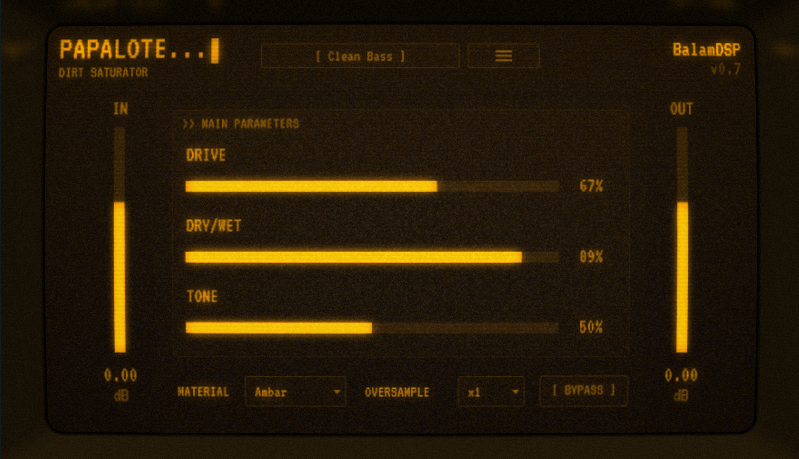

# Papalote — Dirt Saturator Plugin

A VST3 / Standalone audio saturation plugin by **BalamDSP**. Two-stage
anti-aliased polynomial saturation.

Formats: **VST3** + **Standalone** (JUCE 9, CMake).

<p align="center">
  
</p>

## Features

### Saturation engine
- **Two-stage polynomial saturation** with **ADAA1** (anti-derivative
  anti-aliasing): each curve's antiderivative is integrated in closed form
  across the clamp breakpoints, so hard-clip knees stay alias-free without
  requiring oversampling.
- **DRIVE** and **DRY/WET** with a parallel second saturation stage.
- Optional **2x / 4x / 8x / 16x oversampling** on top of the ADAA core.

### Material modes
- 5 tape-material voicings — **Ambar, Obsidiana, Aguamarina, Ceniza,
  Niebla** — each with its own filter and blend constants plus saturation
  character.

### I/O
- **IN** and **OUT** dB faders, **BYPASS** toggle.
- All parameters are host-automatable.

### Interface
- Fixed amber CRT panel with a toggleable **CRT overlay**
  (curvature, phosphor glow, noise, bezel) based on cool-retro-term.

## Building

Requirements: CMake ≥ 3.22, a C++17 compiler (MSVC tested), and JUCE 9. By
default the build uses a local JUCE checkout (`PAPALOTE_JUCE_PATH` cache
entry in `CMakeLists.txt`); when that path does not exist, JUCE 9.0.1 is
fetched automatically — which is how CI builds it.

1. Point the build at your JUCE 9 checkout (edit the `PAPALOTE_JUCE_PATH`
   default or pass `-DPAPALOTE_JUCE_PATH=<path>`), or skip this step to
   fetch JUCE automatically.
2. Configure and build:

   ```sh
   cmake -B build
   cmake --build build --config Release
   ```

3. Artifacts land in `build/Papalote_artefacts/Release/`:
   `VST3/Papalote.vst3` (also copied to the system VST3 folder when
   `PAPALOTE_COPY_AFTER_BUILD` is ON, the default) and
   `Standalone/Papalote.exe`.

A standalone ADAA integrity test suite lives in `tests/`.

## Third-party

| Component | Author | License |
|---|---|---|
| JUCE framework | JUCE Ltd | AGPLv3 |
| JClones Phoenix (saturation curves) | [JClones](https://github.com/JClones/JSFXClones) | MIT |
| cool-retro-term (CRT effect) | Filippo Scognamiglio (Swordfish90) | GPL |
| VT323 typeface | Peter Hull | OFL |

## License

Papalote — Copyright (C) 2026 BalamDSP

This program is free software: you can redistribute it and/or modify it under
the terms of the GNU Affero General Public License as published by the Free
Software Foundation, either version 3 of the License, or (at your option) any
later version.

This program is distributed in the hope that it will be useful, but WITHOUT
ANY WARRANTY; without even the implied warranty of MERCHANTABILITY or FITNESS
FOR A PARTICULAR PURPOSE. See the GNU Affero General Public License for more
details. The full text is in [LICENSE.txt](LICENSE.txt) and at
<https://www.gnu.org/licenses/>.

Third-party components remain under their own licenses (table above).
